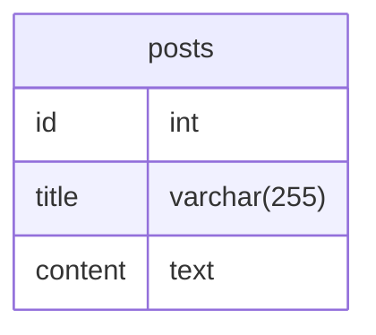
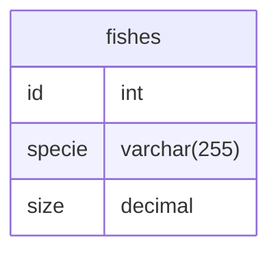

# Resumo

Esse repositório tem como objetivo tentar, de uma forma simples e direta, explicar os conceitos da disciplina de Programação Orientada à Serviços ao passo em que exemplica e documenta os códigos desenvolvidos ou não em sala de aula.
<br><br>

## Recomendações

Se você é aluno (ou até se não for) do IFRN, recomendo fortemente se orientar também ou mesmo primariamente pelo repositório oficial da disciplina do professor <a href="https://github.com/ciromdrs">Ciro Morais</a>. Me inspirei muito nele para fazer essa documentação, então acharia muito bom se pudessem ver também o trabalho dele, o cara é bom demais. Podem <a href="https://github.com/ciromdrs/prog-orientada-a-servicos">acessar aqui</a>.

Também há influência da <a href="https://github.com/charlon-156/MySQL">documentação da disciplina de Banco de Dados</a> que meu colega de classe <a href="https://github.com/charlon-156">Charlon Fernandes</a> escreveu.
<br><br>

## Avisos

Não pretendo me atear as explicações aprofundadas ou seguir a risca o funcionamento técnico literal de uma coisa, apenas explicar de uma forma entendível e exemplificar.

Vou tentar sempre usar três exemplos distintos na hora de codificar: um em `php`, outro em `node` e outro em `python`. Se você só souber `php`, só basta ver o exemplo em `php`. Se só sabe `python`, apenas o de `python`. Se sabe tudo e quiser ver tudo, fique à vontade.

Só o que eu quero dizer com isso, é que eu estarei supondo, caso queria acompanhar qualquer que seja o exemplo, que você possua pelo menos uma dessas linguagens instaladas e configuradas em sua máquina.

Por fim, se tiver alguma sugestão, ou ver que algo está errado e quiser me avisar ou corrigir, sinta-se à vontade.
<br/><br/>

# Sumário

- [Resumo](#resumo)
  - [Recomendações](#recomendações)
  - [Avisos](#avisos)
- [Sumário](#sumário)
- [Introdução](#introdução)
  - [O que é um serviço?](#o-que-é-um-serviço)
  - [O que é uma API?](#o-que-é-uma-api)
    - [Verbos HTTP](#verbos-http)
    - [Endpoints](#endpoints)
    - [Padrão REST](#padrão-rest)
- [Dados semiestruturados](#dados-semiestruturados)
  - [XML](#xml)
  - [JSON](#json)
  - [Qual dos dois usar?](#qual-dos-dois-usar)
- [Testando serviços](#testando-serviços)
    - [Status codes](#status-codes)
    - [Utilizando cURL](#utilizando-curl)
    - [Utilizando Postman]($utilizando-postman)
- [Consumindo um serviço simples](#consumindo-um-serviço-simples)
  - [Fazendo requisição com PHP](#fazendo-requisição-com-php)
  - [Tratando a resposta da requisição com PHP](#tratando-a-resposta-da-requisição-com-php)
    - [Utilizando a biblioteca Guzzle](#utilizando-a-biblioteca-guzzle)
  - [Fazendo requisição com Node](#fazendo-requisição-com-node)
  - [Tratando a resposta da requisição com Node](#tratando-a-resposta-da-requisição-com-node)
  - [Fazendo requisição com Python](#fazendo-requisição-com-python)
  - [Tratando a resposta da requisição com Python](#tratando-a-resposta-da-requisição-com-python)
- [Desenvolvendo nossos serviços](#desenvolvendo-nossos-serviços)
  - [API simples com PHP](#api-simples-com-php)
    - [Configurando nosso projeto Lumen](#configurando-nosso-projeto-Lumen)
    - [Migrações Lumen](#migrações-lumen)
    - [Models Lumen](#models-lumen)
    - [Roteamento Lumen](#roteamento-lumen)
  - [API simples com Python](#api-simples-com-python)
    - [Configurando nosso projeto FastAPI](#configurando-nosso-projeto-fastapi)
    - [Models FastAPI](#models-fastapi)
    - [Roteamento FastAPI](#roteamento-fastapi)
  - [Projetando nossos serviços](#projetando-nossos-serviços)
  - [API para autenticação com Express](#api-para-autenticação-com-express)
- [Consumindo nossos Serviços](#consumindo-nossos-serviços)
    - [Consumindo Serviço no lado do Cliente](#consumindo-serviço-no-lado-do-cliente)
      - [DOM](#dom)
      - [Requisições Ajax](#ajax)
    - [Consumindo Serviço no lado do Servidor](#consumindo-serviço-no-lado-do-servidor)
- [Finalização](#finalização)
- [Referências](#referências)

# Introdução

Programação Orientada à Serviços, do inglês *Service Oriented Programming* (SOP), é uma solução, um paradigma, desenvolvido para facilitar a integração de determinados sistemas à aplicações distintas por meio de serviços.

O Facebook, por exemplo, possui tanto a aplicação web (o site do Facebook), quanto a aplicação para mobile (o aplicativo para celular). Ambas são aplicações tecnicamente distintas mas que implementam os mesmos serviços, pois, uma vez que você faz uma publicação no Facebook pelo celular, você consegue visualizar essa publicação pelo navegador, vice-e-versa.

Isso acontece justamente por estarem utilizando os mesmos serviços.

Seguindo esse racicínio, a imagem a baixo um exemplo bem interessante e intuitivo:


Três empresas distintas com aplicações distintas precisam executar a mesma lógica para cadastrar um cliente. A melhor forma de solucionar esse problema é aplicar a mesma lógica mostrada no exemplo do Facebook: podemos criar um único serviço que é independente dos softwares que irão usá-lo e, nesse serviço, adicionar a função que valida e persiste (salva) um novo cliente no banco de dados.

Dessa forma, reduzimos e muito a repetição de código, o trabalho que seria dar manutenção nessa função e centralizamos toda a *lógica de negócio* em um único ponto, que é justamente o serviço. Tudo o que os softwares das outras empresas precisam fazer é consumir esse serviço; fazer uma requisição para ele com os dados do cliente e pronto, o cliente será salvo no banco de dados.

Além disso, se, por caso, for preciso mudar a lógica de inclusão de cliente, basta apenas modificar o serviço e a consequentemente a mudança será aplicada às outras aplicações.

Agora, vamos nos aprofundar melhor nesses conceitos apresentados, como serviços, web services etc.
<br/><br/>

## O que é um serviço?

No nosso contexto um serviço é o equivalente a uma função de um sistema que está sendo disponibilizada para outro sistema.

Voltando ao exemplo do Facebook, a forma como o aplicativo de celular e o site publicam um post é a mesma, certo? Tão logo, a função que salva um post vai ser a mesma para ambos os sistemas. Dessa forma, podemos transformar essa funcionalidade em um serviço para que ambas as aplicações possam usufruir dessa função apenas chamando o serviço que salva o post.
<br/><br/>

## O que é uma API?

Não pretendo entrar na discussão das diferenças de entre *Application Programming Interface* (API) e *Web Service*; porém, basta entender que, para poder acessar e usar os nossos serviços, iremos utilizar um *Web Service*; que, por sua vez, sempre vai ser uma API. Tão logo, de maneira geral, podemos concluir que: **todo Web Service é uma API, mas nem toda API é um Web Service.** 

Por isso, rotineiramente irei me referir a criação dos nossos *Web Services* como uma API, que vai ser justamente **o sistema que irá contém todos os nossos serviços e que será requisitado toda vez que algum outro sistema precisar de um desses serviços**.

Antes de prosseguir, preciso explicar mais alguns conceitos:

### **Verbos HTTP**

Nossas APIs em suma irão seguir o protocolo HTTP, que em suma, no nosso contexto, é um protocolo que estabelece as operações usadas para comunicação e troca de dados entre cliente e servidor. Essas operações são conhecidas também como *Verbos HTTP* e toda requisição HTTP possui um verbo que evidência e determina a sua intenção.

Existem outros verbos, mas os principais e os que iremos usar são esses:

|Verbo|Descrição|
|---|---|
|GET|Usado para obter um recurso|
|POST|Usado para salvar um recurso ou realiza operações mais sensíveis|
|PUT|Usado para atualizar um recurso|
|DELETE|Usado para deletar um recurso|

É muito importante utilizar o verbo (ou método) certo para o serviço certo. Terá situações onde isso não será possível? Sim, mas sempre tente manter o padrão. Se o seu serviço pretende excluir algum objeto ou recurso, utilize o método DELETE. Se pretende recuperar algum recurso, por exemplo, do banco de dados, use o método GET.

Se ainda não está muito claro como fazer isso, não se preocupe, isso será abordado com detalhes mais adiante.

### **Endpoints**

*Endpoint* é local onde se pode solicitar um recurso ou uma operação de uma API.

Em outras palavras, um *endpoint* na prática nada mais é do que uma **rota** ou uma **url**.

Veja um exemplo de *endpoint*: `https://servicodados.ibge.gov.br/api/v1/localidades/estados`

Esse é um dos vários *endpoints* da API do IBGE. Nesse contexto, uma requisição para esse endpoint irá retornar um recurso (nesse caso, as informações de todos os estados brasileiros) e, se esse endpoint é usado para obter um recurso, ele é do tipo GET.

### **Padrão REST**

*Representational State Transfer* (REST) é um padrão de arquitetura baseado no protocolo HTTP.

Sendo um padrão de arquitetura, o REST delimita e específica como devemos desenvolver nossa API.

Algumas de suas principais características são:

  - As solicitações da arquitetura cliente-servidor devem ser gerenciadas pelo protocolo HTTP
  - Ser stateless (sem estado)
  - Armazenamento em cache para otimização da interação cliente-servidor
  - O formato da informação deve ser padronizado
  - Sistema em camadas para organizar os tipos de servidores
<br/><br/>

# Dados semiestruturados

Dados semiestruturados são comumente chamados de noSQL (não SQL). Todos os bancos de dados relacionais estão estruturados em SQL, que nada mais é do que dizer que eles estão estruturados em tabelas. Dizer que uma estrutura é noSQL é o mesmo que falar que essa estrutura não organiza seus dados por tabelas, colunas e chaves primárias.

Entretanto, esses dados estão sim estruturados, possuem em geral índices ou marcadores para distinguir os elementos e contém hierarquias.

Nessa seção, iremos ver mais sobre duas linguagens que são usadas para estruturar dados. Vão ser nessas formas de estruturas que nossos serviços vão restornar os dados de uma resposta, uma vez que praticamente qualquer linguagem de programação possui uma forma nativa ou alguma biblioteca que consiga interpretar e tratar esse tipo de dado.
<br/><br/>

## XML

*Extensible Markup Language* (XML) é uma linguagem que estrutura os dados de forma hierárquica muito semelhante ao HTML na sintaxe e no formato. Vejamos um exemplo:

```xml
<?xml version="1.0" encoding="UTF-8"?>
<user>
  <id>7</id> <!-- ID -->
  <name>Akemi Adam</name> <!-- Nome -->
  <age>18</age> <!-- Idade -->
  <address> <!-- Endereço -->
    <city>Caicó</city> <!-- Cidade -->
    <district>Rio Grande do Norte</district> <!-- Estado -->
  </address>
</user>
```

Primeiramente, se declara a versão do XML que está sendo utilizada.

```xml
<?xml version="1.0" encoding="UTF-8"?>
```

Depois do atributo version, há o encoding, que diz respeito a codificação e interpretação de caracteres. UTF-8 foi a escolha por aceitar acentos nas letras e outros caracteres especiais.

Seguindo agora para a estruturação de fato dos dados, podemos perceber que ela é bem flexível, mais próxima de uma linguagem natural. Por padrão, se declara sempre um único elemento raiz; essa tag vai conter todos os outros dados. No exemplo, essa tag é o elemento `<user></user>`.

Em seguida, podemos definir outros elementos dentro do nosso elemento raiz. Esses elementos vão corresponder aos dados do usuário no nosso exemplo, como:

```xml
<id>7</id> <!-- ID -->
<name>Akemi Adam</name> <!-- Name -->
<age>18</age> <!-- Idade -->
```

Nesse caso, os atributos do elemento `<user>` vão ser os elementos: `<id>`, `<name>` e `<age>` e terão como valor o que está dentro da tag, respectivamente `7`, `"Akemi Adam"` e `18`.

Tal como no HTML, para representar um comentário em XML, podemos utilizar a tag `<!-- -->`, pondo o nosso comentário entre os traços.

Além de poder inserir os dados diretamente no seu respectivo elemento, podemos colocar outros elementos dentro um elemento para agrupar dados que possuem relação, como é mostrado no exemplo no elemento `<address>`:

```xml
<address> <!-- Endereço -->
  <city>Caicó</city> <!-- Cidade -->
  <district>Rio Grande do Norte</district> <!-- Estado -->
</address>
```

Aqui, o elemento `<address>` guarda dois outros elementos: `<city>`, `<district>`; que tem os respectivos valores: `"Caicó"`, `"Rio Grande do Norte"`

Uma outra forma de estruturar esses dados do usuário é utilizar atributos nos elementos:

```xml
<?xml version="1.0" encoding="UTF-8"?>
<user id="7" name="Akemi Adam" age="18">
  <address city="Caicó" district="Rio Grande do Norte"/>
</user>
```

Dessa forma, refatoramos todos os elementos que representavam algum dado isolado e colocamos eles como atributos dos seus referidos contextos.

Caso queira ver outros exemplos de arquivos XML, <a href="./examples/xml">clique aqui!</a>
<br/><br/>

## JSON

Agora, vamos falar de coisa boa!

*`JavaScript Object Notation`* (JSON) — ou "Jhonson", para os mais íntimos —  é uma estrutura de dados simples, direta, fácil de ler, e rápida que é amplamente utilizada para troca de informações entre sistemas. A grande maioria dos `Web Services` devolvem seus dados em JSON; e praticamente qualquer linguagem de programação que se preze possui alguma forma de ler e processar JSON.

Mas, como é o JSON? Bem, ele é estruturado da seguinte forma:

```json
{
  "id": 7,
  "name": "Akemi Adam",
  "age": 18,
  "address": {
    "city": "Caicó",
    "district": "Rio Grande do Norte"
  }
}
```

Utilizando o mesmo exemplo do XML, podemos identificar que para os dados serem estruturados em JSON, eles precisam estar dentro de um par de chaves global como mostrado abaixo:

```json
{
  // ...
}
```

Uma chave abrindo no início, outra fechando no final.

Prosseguindo, para declarar um atributo (um nome/chave associada a um valor), deve-se escrevé-lo dentro das `{}` globais e dentro de aspas duplas (`""`), como no caso do atributo `"name"`. Após a declaração do atributo, coloca-se o sinal de dois pontos e em seguida o valor do atributo:

```json
{
  "name": "Akemi Adam"
}
```

Os valores que podem ser atribuídos a um atributo podem ser dos seguintes tipos:

  - String (entre aspas duplas)
  - Number
  - Object (par de chaves)
  - Array (par de parênteses)
  - Boolean
  - Null

Uma coisa bem interessante sobre o formato JSON é que ele é um objeto JavaScript. Isso torna muito mais fácil tanto de se entender quanto de se trabalhar com esse tipo de dado.

Em Javascript, poderíamos criar um objeto equivalente ao JSON de usuário assim:

```javascript
const user = {
  id: 7,
  name: "Akemi Adam",
  age: 18,
  address: {
    city: "Caicó",
    district: "Rio Grande do Norte"
  }
}
```

Para mais exemplos em JSON, <a href="./examples/json">clique aqui!</a>
<br>

## Qual dos dois usar?

A resposta depende do contexto e do que você quer fazer.

Para nosso caso, ao decorrer da explicação, irei utilizar e mostrar os exemplos sempre em JSON, pois é o formato mais usado hoje em dia. Em comparação com XML, JSON é muito, muito mais limpo e legível. Utiliza `parse` de String para ler e interpretar os dados e tem a vantagem de se integrar perfeitamente com JavaScript. Além do que, é o que eu tenho mais familiariedade.

Entretanto, posso adicionar posteriormente uma documentação de como trabalhar com XML.
<br/><br/>

# Testando serviços

Algo muito importante de se saber quando está desenvolvendo um *Web Service*/API, é testá-la. Aqui não falo exatamente sobre teste unitários, quem sabe no futuro eu não traga isso, mas me refiro sobre testar se a API está funcionando; se seus endpoints estão todos OKs, por exemplo.

Normalmente, no desenvolvimento web, para ver se uma rota está funcionando, a gente simplesmente só digita a url dela no navegador e ver se a página abre sem nenhum erro. E até dá pra fazer isso com uma rota de API, mas apenas com as rotas do tipo GET. Eu não consigo (normalmente) colocar um endpoint que tem como verbo HTTP o método DELETE no navegador e acessar isso normalmente.

É preciso escrever explicitamente que queremos e como queremos fazer uma requisição desse tipo.

Para isso, existem diversos aplicativos e programas que nos permitem realizar tal função. Logo depois dessa seção, irei mostrar como se consome um serviço a nível de código, para agora quero mostrar como fazer isso por outros meios.
<br><br>

## Status codes

Mas antes, deixa eu falar sobre uma coisa rapidinho: **status codes**.

Status codes nada mais são do que códigos que informam o status de uma requisição; se ela foi bem sucedida ou não, por exemplo. Esses códigos são sempre números de três digitos que vão do intervalo de 100-599, subdivididos em outros conjuntos que representam determinado contexto. Vejamos uma tabela que exemplifica isso bem:

Conjunto|Significado
|-|-|
|100-199|Respostas informativas|
|200-199|Respotas de sucesso|
|300-399|Redirecionamentos|
|400-499|Erros no lado do cliente|
|500-599|Erros no lado do servidor|

Não se preocupe, não precisa decorar todos eles (até porque não existem necessariamente 100 códigos diferentes para cada categoria). Com o tempo, você vai de uma forma ou de outra assimilar seus valores e seus significados, mas por enquanto não esquenta não. Só estou trazendo isso aqui para mostrar para você diferentes respostas que você pode obter ao realizar uma requisição.
<br><br>

## Utilizando cURL

O cURL é um software de linha de comando que atua como um cliente de URL (cURL significa mais ou menos isso). Com ele, podemos realizar requisições HTTP (e de diversos outros protocolos) diretamente no terminal. Quer ver um exemplo?

Se você tem Windows de versões mais recentes, deve bastar digitar no terminal (CMD ou PowerShell) isso:

```bash
curl https://github.com/akemi-adam
```

A sua resposta com certeza foi inúmeras linhas de HTML puro. Por que isso aconteceu? Porque você fez uma requisição (por padrão do tipo GET) para a URL que eu sugeri e a resposta que essa URL devolve é uma página HTML.

Agora, vamos fazer diferente. Vamos fazer uma requisição para algo que não devolve HTML, mas sim JSON.

```
curl https://viacep.com.br/ws/01001000/json/
```

A resposta, dessa vez, foi um objeto JSON assim:

```
{
  "cep": "01001-000",
  "logradouro": "Praça da Sé",
  "complemento": "lado ímpar",
  "bairro": "Sé",
  "localidade": "São Paulo",
  "uf": "SP",
  "ibge": "3550308",
  "gia": "1004",
  "ddd": "11",
  "siafi": "7107"
}
```

Bem doido, né? O bom, é que podemos fazer requisições de outros métodos, como POST, PUT ou DELETE. Porém, nós vamos testar isso depois.
<br><br>

## Utilizando Postman

Normalmente, as pessoas não acham muito agradável interagir com o terminal; não é lá muito intuitivo e dinâmico.

Sendo assim, queria mostrar o Postman: um software para contrução e testagem de API. Ele vai atuar como um cliente, tipo o cURL, que realiza requisições para endpoints, tendo uma interface muito mais amigável e usual.

Pressupondo que você tenha o software instalado, para fazer uma requisição, é bem simples: Apertando no `+` da guia superior, você terá a seguinte tela como resultado:


Nessa interface, podemos escolher o método que queremos utilizar na nossa requisição, o endpoint ao qual a requisição será feita e diversos outras configurações, como parâmetros, tokens de autorização etc.

Aqui, nós vamos apenas deixar o método como GET e colocar o mesmo endpoint de anteriormente. Após isso, podemos apertar em `Send` e enviar.

A resposta será essa:


Mais adiante, usaremos ambas as ferramentas (dando mais prioridade ao cURL pela sua democratização) para testar os endpoints dos *Web Services* que iremos desenvolver.
<br><br>

# Consumindo um serviço simples

Bem, depois de muito falar e pouco praticar, vamos botar a mão na massa! (Alguém ainda usa esse termo?)

Nesse início, porém, iremos apenas consumir Serviços de terceiros (serivços feitos por outras pessoas), não os nossos ainda.

Para isso, irei mostrar de forma bem simples como enviar requisições HTTP para APIs (iremos utilizar apenas APIs públicas aqui) e como processar e tratar as respostas dessas requisições. Vou mostrar sempre três exemplos com três linguagens diferentes.

Para essa seção, utilizarei a mesma API para todos os códigos. Essa API vai ser a API do IBGE. Acho ela muito completa e boa de se trabalhar. A princípio, iremos utilizar o seguinte endpoint:

```
https://servicodados.ibge.gov.br/api/v1/localidades/regioes
```

Esse endpoint retorna todas as regiões do Brasil. **O objetivo aqui é mostrar, de forma formatada e organizada todas as informações sobre cada região do Brasil**, utilizando a API do IBGE.

Com isso em mente, mão na massa!
<br/><br/>

## Fazendo requisição com PHP

Essa primeira forma que mostrarei é apenas para exemplificar. Não recomendo usar isso seriamente; existem bibliotecas muito melhores e mais seguras do que fazer da forma como irei mostrar, mas em um primeiro momento, acho bom demonstrar-la aqui.

Para começar, precisamos criar um arquivo `.php`. Nesse repositório, vou criar ele dentro de `./examples/php/consumindo-api/` (você pode acessá-lo <a href="./examples/php/consumindo-api/index.php">aqui</a>). Darei também o nome de `index.php` para o arquivo. Tendo feito isso, podemos começar a codificar.

Visando ficar mais didático, vamos criar uma variável chamada `$endpoint` que irá armazenar nosso endpoint (uma url da API) que queremos enviar uma requisição:

```php
<?php

// Variável que armazena o endpoint 
$endpoint = 'https://servicodados.ibge.gov.br/api/v1/localidades/regioes';
```

Esse endpoint é do tipo GET. Sei disso porque está específicado na sua <a href="https://servicodados.ibge.gov.br/api/docs/localidades#api-Regioes-regioesGet">documentação</a>, que especifica as características de cada endpoint, como seu verbo HTTP.

Uma vez tendo nosso endpoint, iremos utilizar a função `file_get_contents()` do PHP. Essa função é utilizada para ler o conteúdo de algum arquivo, como um arquivo `.txt`, por exemplo. Só que ela também serve para realizar requisições HTTP, e é desse modo que nós a iremos usar. Para isso, basta passar nosso endpoint como primeiro parâmetro da função:

```php
<?php

// Variável que armazena o endpoint 
$endpoint = 'https://servicodados.ibge.gov.br/api/v1/localidades/regioes';

// Faz uma requisição para o endpoint especificado e armazena sua resposta em $response
$response = file_get_contents($endpoint);
```

Com isso, nós estamos fazendo uma requisição (do tipo GET, por padrão) para o endpoint `https://servicodados.ibge.gov.br/api/v1/localidades/regioes` e armazenando a resposta dessa requisição na variável `$response`. Se você pegar essa url, colocar no seu navegador e der enter, vai ver que o que vai aparecer é algo que você já viu e espero que tenha aprendido aqui:


Sim, justamente: um JSON! Bem feio e mal formatado? Sim, mas ainda é um JSON. Na verdade, mais especificamente, isso é um JSON que contém uma lista. Nessa lista estão armazenados outros objetos JSON. Cada um desses objetos (delimitados pelos pares de `{}`) está representando uma região do Brasil com suas características. Como por exemplo o primeiro objeto, que representa a região Norte. Para deixar mais legível, deixa eu organizar melhor:

```json
{
  "id": 1,
  "sigla": "N",
  "Nome": "Norte"
},
// ...
```
<br>

## Tratando a resposta da requisição com PHP

Muito massa, né? Porém, nossa variável `$response` ainda não pode ser lida completamente. Isso porque, a função `get_file_contents()` ler o conteúdo do arquivo (nesse caso do nosso endpoint) e transforma ele numa String. Se dermos um `var_dump()` na variável `$response` vamos ver isso com clareza:

```php
var_dump($response); // Mostra o tipo e o valor da variável
```

A resposta seria a seguinte:

```
string(194) "[{"id":1,"sigla":"N","nome":"Norte"},{"id":2,"sigla":"NE","nome":"Nordeste"},{"id":3,"sigla":"SE","nome":"Sudeste"},{"id":4,"sigla":"S","nome":"Sul"},{"id":5,"sigla":"CO","nome":"Centro-Oeste"}]"
```

Porém, para conseguirmos utilizar a resposta desse endpoint, vamos precisar transformar esse JSON que está no formato de uma String em um objeto PHP.

Nativamente, graças a Deus, o PHP já oferece uma função para fazer isso por nós. Ela se chama `json_decode()`. Como o nome sugere, essa função vai decodificar um JSON que está armazenado em uma String e transformá-lo em um objeto PHP. A partir disso, vamos conseguir utilizar os dados da resposta da requisição (`response`) adequadamente:

```php
<?php

$endpoint = 'https://servicodados.ibge.gov.br/api/v1/localidades/regioes';

$response = file_get_contents($endpoint);

$regions = json_decode($response);
```

Aqui, armazenamos a decodificação do JSON de `$response` na variável `$regions`. Se dermos um `var_dump()` em `$regions`, vamos ver que agora sim podemos usar a resposta da requisição:

```
array(5) {
  [0]=>
  object(stdClass)#1 (3) {
    ["id"]=>
    int(1)
    ["sigla"]=>
    string(1) "N"
    ["nome"]=>
    string(5) "Norte"
  }
  [1]=>
  object(stdClass)#2 (3) {
    ["id"]=>
    int(2)
    ["sigla"]=>
    string(2) "NE"
    ["nome"]=>
    string(8) "Nordeste"
  }
  [2]=>
  object(stdClass)#3 (3) {
    ["id"]=>
    int(3)
    ["sigla"]=>
    string(2) "SE"
    ["nome"]=>
    string(7) "Sudeste"
  }
  [3]=>
  object(stdClass)#4 (3) {
    ["id"]=>
    int(4)
    ["sigla"]=>
    string(1) "S"
    ["nome"]=>
    string(3) "Sul"
  }
  [4]=>
  object(stdClass)#5 (3) {
    ["id"]=>
    int(5)
    ["sigla"]=>
    string(2) "CO"
    ["nome"]=>
    string(12) "Centro-Oeste"
  }
}
```

Perceba que `$regions` armazena um array invés de um objeto. Isso acontece justamente porque, se você olhar o JSON do nosso endpoint, vai ver que ele retorna uma lista de objetos, e não um único objeto. Dessa forma, nós temos um array de objetos em PHP que podemos utilizar como bem quisermos.

Agora, é só lógica de programação. Vamos percorrer esse array em um loop (utilizando `foreach`) e exibir nossa mensagem:

```php
<?php

$endpoint = 'https://servicodados.ibge.gov.br/api/v1/localidades/regioes';

$response = file_get_contents($endpoint);

$regions = json_decode($response); // Exibe uma mensagem e quebra linha

echo "---------------------- Regiões do Brasil ----------------------\n";

// Percorre o array $regions mostrando uma mensagem padrão para todas as regiões
foreach ($regions as $region)
{
    echo "Região " . $region->nome . " tem como sigla " . $region->sigla . " e ID " . $region->id . "\n";
}
```

E pronto, é só isso! O código acima é literalmente: um título (Regiões do Brasil) e um laço de repetição do tipo `foreach` que vai pecorrer cada linha do array $regions. Como esse array só contém objetos que possuem os mesmo atributos (nome, sigla e id), então eu coloquei um echo dentro do `foreach` para imprimir uma mensagem informando as informações de cada um dos objetos que está dentro do array; ou seja: cada uma das regiões do Brasil.

A saída disso é:

```
---------------------- Regiões do Brasil ----------------------
Região Norte tem como sigla N e ID 1
Região Nordeste tem como sigla NE e ID 2
Região Sudeste tem como sigla SE e ID 3
Região Sul tem como sigla S e ID 4
Região Centro-Oeste tem como sigla CO e ID 5
```

### **Utilizando a biblioteca Guzzle**

Na forma mostrada acima, nós utilizamos a função `get_file_contents()` para atuar como cliente HTTP e fazer a nossa requisição. Entretanto, existem alternativas melhores e mais seguras, como utilizar uma biblioteca. No caso do PHP, a biblioteca que eu considero mais famosa e simples de usar, é a Guzzle. Vou mostrar como fazer a mesma requisição acima utlizando ela.

Primeiro de tudo, é preciso instalar ela. Para instalá-la, é preciso ter o `Composer` instalado em sua máquina. Composer é um gerenciador de pacotes. Você pode <a href="https://getcomposer.org/download/">baixá-lo aqui</a> caso ainda não o tenha.

Com o composer instalado, vamos rodar o seguinte comando para iniciar um projeto: `composer init`. Você pode dar enter em todas as perguntas que aparecerem (se quiser responde-las também, fique à vontade), elas não importam muito para o nosso contexto.

Agora, com um projeto iniciado, o Composer terá criado algumas pastas para você. São elas: `src` e `vendor`; além de um arquivo `composer.json`. Esse arquivo serve para configurações do pacote. Ele deve se parecer com isso:

```json
{
    "name": "akemi-adam/exemplo",
    "autoload": {
        "psr-4": {
            "AkemiAdam\\Exemplo\\": "src/"
        }
    },
    "authors": [
        {
            "name": "Akemi Adam",
            "email": "90357785+akemi-adam@users.noreply.github.com"
        }
    ],
    "require": {}
}
```

O que importa aqui para nós, é o primeiro e único atributo que está dentro de `"psr-4"`. No meu caso é: `"AkemiAdam\\Exemplo\\"`. Esse nome é o namespace do nosso pacote. Possívelmente estará diferente no seu projeto caso esteja seguindo esse passo a passo, mas o que importa é ter esse nome e reconhece-lo. Esse namespace possibilita que possamos utilizar outras classes de outras pastas em nossos arquivos. Onde essas classes vão ficar? Dentro da pasta `src`.

Vou criar um arquivo na raiz do projeto chamado de `index.php`. Nesse `index.php`, vou colocar a seguinte linha de código:

```php
<?php

require_once __DIR__ . '/vendor/autoload.php';
```

Com esse `require_once` direcioando para esse arquivo `autoload.php`, vamos poder carregar e usar nossas classes a partir do nosso namespace.

Agora, vamos finalmente baixar o pacote `Guzzle`. Para isso, digite o comando:

```shell
composer require guzzlehttp/guzzle
```

Agora, vamos usar essa biblioteca para fazer uma requisição para o nosso endpoint:

```php
<?php

require_once __DIR__ . '/vendor/autoload.php';

use GuzzleHttp\Client;

$client = new Client;

$response = $client->get('https://servicodados.ibge.gov.br/api/v1/localidades/regioes');

$regions = json_decode($response->getBody());
```

Aqui, nós criamos um objeto `Client` e usamos o método `get()` dessa classe para fazer uma requisição GET para o endpoint passado por parâmetro. Armazenando isso em `$response`, nós fazemos praticamente a mesma coisa que no outro exemplo: passa `$response` como parâmetro de `json_decode()` e guarda em `$regions`. Aqui, no entanto, para pegar os dados da requisição, precisamos usar esse método `getBody()` do objeto `$response`.

Para mostrar a mensagem, iremos criar uma arquivo dentro de `src` chamado `IBGE.php`. O conteúdo desse arquivo será o seguinte:

```php
<?php

namespace AkemiAdam\Exemplo;

class IBGE
{
  /**
   * Retorna a mensagem formatada
   */
  public function toString(stdObject $region) : string
  {
      return "Região " . $region->nome . " tem como sigla " . $region->sigla . " e ID " . $region->id . "\n";
  }

  /**
   * Imprime a mensagem para todas as regiões
   */
  public function showRegions(array $regions) : void
  {
    echo "---------------------- Regiões do Brasil ----------------------\n";

    foreach ($regions as $region)
        echo $this->toString($region);
  }
}
```

Nele, a primeira coisa que fazemos é declarar o namespace, que nesse caso vai ser justamente aquele que eu havia falado. Isso pode variar, como comentei. Enfim: criamos uma classe chamada IBGE e dentro dessa classe criamos a função `toString()` que mostra a mensagem formatada de uma região. Outra função também foi criada: `showRegions`, que mostra a mensagem formatada de todas as regiões passada por parâmetro.

Agora, precisamos usar essa classe no nosso arquivo `index.php`:

```php
<?php

require_once __DIR__ . '/vendor/autoload.php';

// Importa a classe Client
use GuzzleHttp\Client;

// Importa a nossa classe IBGE
use AkemiAdam\Exemplo\IBGE;

// Instância um objeto do tipo Client
$client = new Client;

// Faz a requisição GET
$response = $client->get('https://servicodados.ibge.gov.br/api/v1/localidades/regioes');

// Decodifica o corpo da requisição com os dados
$regions = json_decode($response->getBody());

// Instância nossa classe IBGE
$ibge = new IBGE;

// Imprime os dados das regiões
$ibge->showRegions($regions);
```

A saída será a mesma que no outro exemplo:

```
---------------------- Regiões do Brasil ----------------------
Região Norte tem como sigla N e ID 1
Região Nordeste tem como sigla NE e ID 2
Região Sudeste tem como sigla SE e ID 3
Região Sul tem como sigla S e ID 4
Região Centro-Oeste tem como sigla CO e ID 5
```
<br>

## Fazendo requisição com Node

Antes de prosseguir, por algumas questões técnicas, irei, para esse exemplo, utilizar um outro endpoint. É ele:

```
https://bible-api.com/Salmos+94:11?translation=almeida
```

Esse endpoint retorna as informações sobre um versículo específico da bíblia; nesse caso, Salmos 94: 11.

Por que escolhi essa rota? Achei peculiar.

Enfim, vamos prosseguir:

Particularmente, para fazer uma requisição com Node, eu gosto bastante de utilizar a biblioteca `Axios`. Ela é simples e muito fácil de usar, além de ser bem poderosa. Aqui, mostrarei como fazer uma simples requisição GET para o nosso endpoint utilizando essa biblioteca.

No diretório `./examples/node/consumindo-api/` desse repositório irei criar um arquivo `index.js`, onde escreveremos nosso código.

Porém, antes de prosseguir, precisamos instalar a biblioteca axios. Para isso, temos que executar o comando:

```
npm i axios
```

Após isso, alguns arquivos de `.json` de configuração e uma pasta `node_modules` deve ser criada.

Vamos então abrir o nosso arquivo `index.js` e escrever o seguinte:

```javascript
// Importa o modulo axios
const axios = require('axios')

// Armazena nosso endpoint
const endpoint = 'https://bible-api.com/Salmos+94:11?translation=almeida';
```

Essas linhas de código são simples: importamos o axios e guardamos na constante de mesmo nome e salvamos nosso endpoint em `endpoint`.

Agora, vamos fazer nossa requisição com o objeto `axios`:

```javascript
const axios = require('axios')

const endpoint = 'https://bible-api.com/Salmos+94:11?translation=almeida';

axios.get(endpoint)
```

Com isso, nós conseguimos fazer uma requisição do tipo GET para o endpoint específicado. Vejamos agora como podemos processar e tratar isso.
<br><br>

## Tratando a resposta da requisição com Node

Conseguimos fazer a nossa requisição, porém não estamos fazendo nada com ela, como dá para observar.

Para mudar isso, precisamos entender que o que essa função retorna, é uma `Promisse`. Se você não sabe exatamente o que é uma Promisse, ou não viu ainda a parte de funções assíncronas com `async-await`, não se preocupe, vou tentar explicar de forma resumida e direta.

Uma `Promisse` nada mais é do que uma promessa, como o nome sugere. Essa promessa é um objeto que funciona de forma assíncrona no código. Ou seja: você consegue executar outras partes do código ao mesmo tempo em que essa `Promisse` está sendo "resolvida".

A `Promisse` como objeto tem três estados: `pendente` (quando ela ainda não foi resolvida, ou seja: está pendente), `resolvida` e `rejeitada` (quando ocorre algum erro que impeça ela de ser resolvida).

Quando a `Promisse` é resolvida ou rejeitada, nós podemos usar uma função de `callback` para executar qualquer coisa que quisermos para essas duas situações. Podemos acessar esses estados por meio das funções: `then()` e `catch()`, popularmente chamadas de `thencat`; não é a mesma coisa, mas uma analogia que gosto de fazer é com os blocos `try-catch`. Se a `Promisse` for bem sucedida, a função `then()` vai ser executada; similar com o bloco `try {}`. Já se ela for rejeitada, se ocorrer algum erro, a função `then()` será ignorada e a função `catch()` vai capturar esse erro e ser executada; como o bloco `catch {}`.

Assim sendo, depois dessa breve explicação monóloga sobre programação assíncrona em `JavaScript`, deixa eu mostrar como vamos aplicar isso no nosso código:

```javascript
const axios = require('axios')

const endpoint = 'https://bible-api.com/Salmos+94:11?translation=almeida';

// A função then() recebe uma função de callback para ser executada quando a Promisse for resolvida
axios.get(endpoint).then(
    // Passamos o objeto response para essa callback
    response => {
        // reponse possui os dados da resposta de nossa requisição
        // Com isso, acessamos a propriedade data desse objeto para guarda o JSON numa variável
        const versicle = response.data
    }
// Caso ocorra alguma falha, o callback da função catch vai ser executado mostrando uma mensagem de erro simples
).catch(
    err => console.log(`Ocorreu um error: ${err}`)
)
```

Como descrito no próprio código, nossa função then recebe uma arrow function que atua como uma função de callback para ser executada sempre que a `Promisse` for resolvida. Essa nossa `Promisse` possui um objeto `response` que guarda a resposta da nossa requisição; passamos esse objeto como parâmetro do callback. Em seguida, acessamos o atributo `data` do objeto `response` e guardamos ele dentro da constante `versicle`. Esse atributo `data` armazena JSON que o nosso endpoint retorna. Por fim, a função catch está ali para ser executada caso ocorra algum erro com a `Promisse`.

Agora, tudo o que precisamos fazer é, dentro do callback da função then, estruturar nossa mensagem.

```javascript
axios.get(endpoint).then(
    response => {
        const versicle = response.data

        console.log('---------------------- Versículo ----------------------\n')

        console.log(`${versicle.reference} diz:\n${versicle.text}`)
    }
).catch(
    err => console.log(`Ocorreu um error: ${err}`)
)
```

Agora, se executarmos esse código com o comando `node index.js`, teremos a seguinte resposta:

```
---------------------- Versículo ----------------------

Salmos 94:11 diz:
o Senhor, conhece os pensamentos do homem, que são vaidade.
```
<br>

## Fazendo requisição com Python

Agora, com Python, podemos enfim voltar para o nosso tão amado endpoint do IBGE (já estava com saudades):

```
https://servicodados.ibge.gov.br/api/v1/localidades/regioes
```

Como de costume, irei criar um arquivo `index.py` no seguinte diretório desse nosso repositório: `./examples/python/consumindo-api/`. Nesse arquivo, vamos usar o módulo `http.client` para fazer nossas requisições:

```python
import http.client
```

Com esse módulo, podemos estabelecer — criar — uma conexão com a API para poder fazer uma requisição ao nosso endpoint:

```python
import http.client

# Cria uma conexão com a URI base do nosso endpoint
connection = http.client.HTTPSConnection('servicodados.ibge.gov.br')
```

Como a API do IBGE usa o protoclo HTTPS (resumidamente o protocolo HTTP que utiliza o protocolo SSL de segurança), precisamos criar uma `HTTPSConnection` com a `URI` base da API.

Com isso, podemos enviar uma requisição para o nosso endpoint usando a função `request()`, tendo em vista que não precisamos escrever toda a `URI`, apenas o path da rota do nosso endpoint:

```python
import http.client

connection = http.client.HTTPSConnection('servicodados.ibge.gov.br')

# Faz a requisição GET para o nosso endpoint
connection.request('get', '/api/v1/localidades/regioes')
```
<br>

## Tratando a resposta da requisição com Python

Nosso objeto `connection` agora possui a `Response` da requisição armazenado em si. Para recuperar, podemos usar a função `getresponse()`:

```python
# Recupera a resposta dessa requisição
response = connection.getresponse()
```

Response possui um método (função) chamado `read()`, que retorna o JSON do endpoint, que é o que nós queremos. Esse JSON, no entanto, vem como uma String, tal como ocorre lá com PHP. Assim sendo, precisamos importar o módulo `json` para conseguir processar esse JSON em um formato apropriado, nesse caso uma lista. No topo do arquivo, embaixo do primeiro `import`, vamos adicionar outro:

```python
import http.client
import json
```

Seguindo em frente, vamos usar a função `loads()` do objeto json para decodificar nosso JSON:

```python
import http.client
import json

connection = http.client.HTTPSConnection('servicodados.ibge.gov.br')

connection.request('get', '/api/v1/localidades/regioes')

response = connection.getresponse()

regions = json.loads(response.read())
```

Nesse momento, não precisamos mais fazer nenhuma requisição, então podemos fechar a conexão com:

```python
connection.close()
```

Dessa forma, tudo o que precisamos fazer agora é passar essa variável `regions`, que armazena uma lista, para um `for` e montar nossa mensagem que vai ser exibida:

```python
print('--------------------- Regiões do Brasil ----------------------\n')

# Percorre a lista enquanto imprime a mensagem
for region in regions:
    print('Região {0} tem como sigla {1} e ID {2}'.format(
        region['nome'], region['sigla'], region['id']
    ))
```

Ao executar `py index.py` no terminal, teremos a seguinte saída:

```
--------------------- Regiões do Brasil --------------------

Região Norte tem como sigla N e ID 1
Região Nordeste tem como sigla NE e ID 2
Região Sudeste tem como sigla SE e ID 3
Região Sul tem como sigla S e ID 4
Região Centro-Oeste tem como sigla CO e ID 5
```

<br>

# Desenvolvendo nossos serviços

Finalmente, chegamos na parte que eu tanto queria. Possívelmente a parte mais demorada, mas a que eu acho mais legal. Depois de vermos como consumir uma API de terceiros, que tal ver como uma API funciona, construíndo uma?!

Aqui, iremos desenvolver duas APIs primeiramente: uma em PHP (utilizando o framework **Lumen**) e outra em Python (com **FastAPI**). Já adianto que não precisa ser expert ou mesmo saber algum desses frameworks. Eu particularmente nunca havia programando nessas duas tecnologias antes, mas só quero que vocês vejam os princípios e as coisas em comum que nossas APIs terão.

Depois disso, iremos fazer algo mais complexo juntando nossos serviços, mas por enquanto, se atente apenas nos princípios que aprendeu até aqui e na aplicação deles.
<br><br>

## API simples com PHP

Como estamos utilizando o padrão REST, nossa API vai seguir esse padrão. Em, novamente, devo dizer: vamos tentar sempre seguir os princípios de visibilidade das requisições HTTP, sempre responder em JSON e não utilizar estado de sessão.

Essa nossa API em Lumen vai realizar um CRUD (Create, Read, Update e Delete) de um modelo (representação de uma tabela do banco como um objeto em uma linguagem de programação). O modelo que eu escolhi foi o de Publicações, que vou chamar de Posts. Esses posts terão a seguinte estrutura:



Como é apenas uma tabela isolada, vou usar como banco de dados o `SQLite`, já que podemos todos os nossos dados em um único arquivo pequeno.

Já relativo aos endpoints da nossa API, teremos os seguintes:

|Método|Endpoint|Descrição|
|-|-|-|
|GET|http://localhost:8000/post|Lista todas as postagens|
|POST|http://localhost:8000/post|Salva uma postagem no banco|
|GET|http://localhost:8000/post/{id}|Mostra uma postagem específica|
|PUT|http://localhost:8000/post/{id}|Atualiza uma postagem|
|DELETE|http://localhost:8000/post/{id}|Deleta uma postagem|

Com tudo explicado, vamos programar de fato!
<br><br>

### Configurando nosso projeto Lumen

Tendo o composer instalado, podemos criar um projeto `Lumen` simplesmente com o seguinte comando:

```
composer create-project --prefer-dist laravel/lumen <nome da sua aplicação>
```

Basta escolher um diretório que queria criar o projeto e troca `<nome da sua aplicação>` pelo nome do seu aplicativo. No nosso caso, vou trocar por `simple-lumen-api` (API Lumen simples). Depois de alguns minutos, uma pasta com o nome do projeto será criada contendo todos os arquivos necessários do framework. A estrutura do proejto será essa:


Não sei se deu para perceber, mas se você já usou `Laravel`, vai ver como é quase identico ao meu tão amado framework. O motivo? Lumen foi feito baseado em Laravel pelo próprio criador do Laravel. Ele é um framework para desenvolver APIs mais leves e pequenas em Laravel; afinal, *não queremos acertar um tiro numa latinha de refrigerante com uma bazuca, né*?

Bem, com o projeto instalado, precisamos configurar algumas coisas antes de começar a programar.

Primeiro de tudo são as variáveis de ambiente do arquivo `.env` na raiz do projeto.

Como vamos usar `SQLite`, a única coisa que precisamos fazer é comentar quase todas as linhas de configuração do Banco de Dados e apenas dizer que o nosso projeto vai usar `SQLite`. Nosso `.env` ficará assim:

```
APP_NAME=Lumen
APP_ENV=local
APP_KEY=
APP_DEBUG=true
APP_URL=http://localhost
APP_TIMEZONE=UTC

LOG_CHANNEL=stack
LOG_SLACK_WEBHOOK_URL=

DB_CONNECTION=sqlite
# DB_HOST=127.0.0.1
# DB_PORT=3306
# DB_DATABASE=homestead
# DB_USERNAME=homestead
# DB_PASSWORD=secret

CACHE_DRIVER=file
QUEUE_CONNECTION=sync
```

Dizendo que a conexão do banco será com `SQLite` e comentando as linhas de baixo com `#`, o Lumen irá buscar um arquivo chamado `database.sqlite` dentro de `./database/` para atuar como banco de dados. Então, vamos criar:


Só precisamos criar esse arquivo nesse diretório; vazio mesmo, sem nada dentro.

Agora, vamos editar o seguinte arquivo: `./bootstrap/app.php`.

Dentro desse arquivo, vamos procurar o seguinte trecho de código que está comentado:

```php
$app = new Laravel\Lumen\Application(
  dirname(__DIR__)
);

//$app->withFacades();

//$app->withEloquent();
```

Vamos apenas descomentá-lo:

```php
$app = new Laravel\Lumen\Application(
  dirname(__DIR__)
);

$app->withFacades();

$app->withEloquent();
```
<br>

### **Migrações Lumen**

Depois de configurar o projeto, vamos criar nossas migrações. Para tal, é o mesmo processo que no Laravel; basta digitar o seguinte comando:

```bash
php artisan make:migration "create posts table"
```

Um novo arquivo de migração será criado em `./database/migrations/` com um nome muito extenso mas que vai ter a data da criação e `create_posts_table`.

O arquivo deverá ser mais ou menos assim:

```php
<?php

use Illuminate\Database\Migrations\Migration;
use Illuminate\Database\Schema\Blueprint;
use Illuminate\Support\Facades\Schema;

return new class extends Migration
{
  /**
    * Run the migrations.
    */
  public function up(): void
  {
    Schema::create('posts', function (Blueprint $table) {
      $table->id();
      $table->timestamps();
    });
  }

  /**
    * Reverse the migrations.
    */
  public function down(): void
  {
    Schema::dropIfExists('posts');
  }
};
```

Dentro do callback de `Schema::create()`, vamos adicionar as colunas de `title` (que é um `varchar`/`string`) e `content` (do tipo `text`) para a nossa tabela:

```php
Schema::create('posts', function (Blueprint $table) {
  $table->id();
  $table->string('title');
  $table->text('content');
  $table->timestamps();
});
```

Após isso, podemos simplesmente usar o comando `php artisan migrate` para rodar nossas migrações e criar nossa tabela no banco.
<br><br>

### **Models Lumen**

Nossos modelos em Lumen seguem literalmente o mesmo padrão que usamos no Laravel (se você já usou Laravel, é claro).

Ou seja: se nossa tabela se chama `posts`, nosso modelo dessa tabela vai ser o singular do nome da tabela com a primeira letra em maiúsculo. Nesse caso, nosso model se chamará `Post`.

Só que, diferente do Laravel onde temos o comando `php artisan make:model <nome do modelo>` para criar nosso modelo, aqui a gente não tem isso. Em geral só há um gato pingado ali ou aqui de comandos `artisan`. Então precismaos criar nosso arquivo `Post.php` na mão.

Muito simples: vá para o diretório `./app/Models/` e aí dentro crie um arquivo chamado `Post.php` com o seguinte conteúdo:

```php
<?php

namespace App\Models;

use Illuminate\Database\Eloquent\Model;

class Post extends Model
{
    protected $fillable = [
        'title',
        'content'
    ];
}
```

A partir desse arquivo, configurado dessa forma (há muitas outras configurações possíveis, mas essas já bastam para nós), a gente vai poder interagir com a tabela de publicações sem ter que escrever uma linha de `SQL` e abstrair tudo isso para o código.
<br><br>

### **Roteamento Lumen**

Agora, vamos criar as rotas da nossa API (ou endpoints).

Para isso, vamos no arquivo `./routes/web.php`. Ele vai estar assim:

```php
<?php

/** @var \Laravel\Lumen\Routing\Router $router */

/*
|--------------------------------------------------------------------------
| Application Routes
|--------------------------------------------------------------------------
|
| Here is where you can register all of the routes for an application.
| It is a breeze. Simply tell Lumen the URIs it should respond to
| and give it the Closure to call when that URI is requested.
|
*/

$router->get('/', function () use ($router) {
  return $router->app->version();
});
```

Por padrão, o Lumen vem com essa rota `/` que mostra a versão do framework. Falando ligeiramente sobre o que está acontecendo aqui, é o seguinte: o framework possui esse objeto `$router` que é o "roteador" da aplicação; que cria e gerencia as rotas da API. Quando queremos criar um endpoint, precisamos chamar esse objeto e chamar alguma função dele que corresponda a um verbo HTTP (get, post, put, delete etc). Nessa rota que vem por padrão, o método HTTP usado é o GET. Dentro dessa função, o primeiro parâmetro será o `path` do endpoint (caminho da rota) e o segundo vai ser a ação (nesse caso um callback) que vai ser executado ao acessar esse endpoint.

Porém, não vamos usar uma função de callback. Vamos utilizar funções de um `Controller`, uma classe especial para lidar com as funcionalidades das nossas rotas e suas regras de negócios. Vou mostrar como criar um controller na próxima seção, mas por agora, vamos definifir nossas rotas nesse arquivo (pode deletar essa rota padrão se quiser):

```php
<?php

$router->get('/', function () use ($router) {
  return $router->app->version();
});

// Nossas rotas

$router->get('/post', 'PostController@index');

$router->post('/post', 'PostController@store');

$router->get('/post/{id}', 'PostController@show');

$router->put('/post/{id}', 'PostController@update');

$router->delete('/post/{id}', 'PostController@destroy');
```

Perceba que cada uma dessas rotas corresponde a um dos nossos endpoints que eu determinei naquela tabela anteriormente.

Além disso, veja que aqui, invés de passar um callback como segundo parâmetro, estamos passando uma String. Essa String é dividida em duas partes pelo símbolo do `@` determina qual controller iremos usar e qual função desse controller vai ser usada para essa rota: `<Controller>@<Função>`.
<br><br>

### **Controllers Lumen**

Tal como o modelo, vamos precisar criar nosso controlador na força de vontade. Para isso, crie um arquivo chamado `PostController.php` dentro de `./app/Http/Controllers/`. Vamos escrever nosso controllador dessa forma inicialmente:

```php
<?php

namespace App\Http\Controllers;

use Illuminate\Http\JsonResponse;
use Illuminate\Http\Request;
use App\Models\Post;


class PostController extends Controller
{
  //
}
```

Efetivamente, isso não faz nada. Então vamos criar nossas funções.

A primeira será a função `index()`, que vai corresponder ao seguinte endpoint do tipo GET: `http://localhost:8000/post`. Ficou determinado que esse seria o endpoint responsável por devolver a lista de todas as postagens. Então, dentro da classe `PostController`, vamos escrever uma função que faça isso:

```php
/**
 * Retorna uma lista em JSON com todas as publicações
 */
public function index() : JsonResponse
{
  return response()->json(Post::all(), 200);
}
```

Show? Beleza. Mas Akemi, me diz o seguinte: o que diabos isso está fazendo?

Calma, meu filho, vem comigo: esse simples código retorna um JSON (Mais especificamente um objeto `JsonResponse`). Sim, um JSON que você já viu aqui. Agora, o conteúdo desse JSON que é interessante: como primeiro parâmetro, estou passando a chamada de uma função. Essa função é chamada a partir da classe `Post`, que, opa, opa, é o nosso modelo que criamos agora há pouco. Mas, o que faz esta função `all()` do modelo? Essa retorna uma lista (uma coleção) contendo todos os dados (linhas) da nossa tabela `posts`. Com isso, a função `response()->json()` tranforma essa coleção em um JSON e retorna para quem estiver chamando esse endpoint da nossa API.

E o que é esse número depois do `Post::all()`? Esse é o `status code` desse endpoint. O código 200 significa OK; serve para requisições GET, informando que algum recurso foi encontrado com sucesso (nesse caso, a lista com as postagens).

Mas, como eu sei que isso está funcionando? Simples, podemos fazer uma chamada para esse endpoint. Mas antes, com o terminal aberto no diretório do projeto, temos que subir o servidor. Podemos usar o próprio servidor embarcado do PHP para isso (uma vez que estamos em ambiente de desenvolvimento). Digite o comando:

```powershell
php -S localhost:8000 -t public
```

Agora, podemos testar nossa API. Por ser mais prático, irei usar o Postman para testar:


O resultado:


Como não criamos nenhum registro na tabela, nossa rota retorna uma lista vazia. Vamos então criar o endpoint para cadastrar uma postagem.

De volta `PostController`, adicione a seguinte função:

```php
/**
 * Cria uma publicação e retorna ela em JSON
 * 
 * @param Request $request
 * 
 * @return JsonResponse
 */
public function store(Request $request) : JsonResponse
{
  $this->validate($request, [
      'title' => 'required|string',
      'content' => 'required|string'
  ]);

  return response()->json(Post::create($request->all()), 201);
}
```

Essa função store é a responsável por salvar uma postagem no banco de dados. Tem como parâmetro um objeto `Request`, que representa a nossa requisição para esse endpoint.

Dentro da função, há a chamada de um método interno `validate()`, que recebe dois parâmetro: a `$request` e um array. Nesse array, podemos definir regras para validar os dados da requisição. Nesse caso, defino que o campo `title` precisa ser uma String e é obrigatório. Digo o mesmo para o campo `content`. Se essas regras não forem obdecidas, a função retornará um erro e não criará a postagem.

Por fim, a função retorna um objeto JSON, tendo como primeiro parâmetro `Post::create($request->all())`. Esse trecho de código é justamente quem salva a postagem no banco de dados. a função `$request->all()` retorna um array com todos os dados do corpo da requisição (entenda como todos os dados que enviamos para requisição; nesse caso, `title` e `content`).

Já a função `Post::create()` cria um post no banco com base nos dados passados por parâmetro e retorna um objeto do modelo específico, que nesse caso é um objeto `Post` representando uma postagem em específico. Logo, esse endpoint devolve um JSON contendo os dados de um Post específico. Além disso, o código escolhido aqui foi o 201, usado quando um recurso é criado com sucesso.

Agora sim nós conseguimos testar nossa API. O endpoint aqui é igual ao anterior, somente o tipo do método que muda de GET para POST.


A resposta:


Se a gente ocultar um dos campos do body (corpo) da requisição ou colocar algum deles como algo que não seja String, teremos a seguinte resposta:


Agora, para provar que não estou mentindo, vamos fazer outra requisição para nossa rota que lista todos os posts:


**Nota:** Há mais alguns posts, pois eu já havia testado antes. Mas se você olhar o último objeto, verá que ele é justamente a nossa postagem que criamos aqui.

O próximo endpoint que vamos fazer é o da função `show()`. Esse endpoint vai mostrar as informações sobre um post específico. Essa rota é do tipo GET e ela precisa ter um parâmetro na URL. Esse parâmetro é o `id` do post. Se você olhar definição da rota show, lá no `web.php`, verá que em seu path ela tem um `{id}`. Isso indica que ela vai receber um parâmetro pela rota e que esse parâmetro será um id, então, novamente ao `PostController`, teremos que escrever a seguinte função:

```php
/**
 * Retorna um objeto JSON de uma publicação específica
 * 
 * @param int $id
 * 
 * @return JsonResponse
 */
public function show(int $id) : JsonResponse
{
  return response()->json(Post::findOrFail($id), 200);
}
```

Bem simples, parecida com a `index()`. Só que aqui, como ela recebe um parâmetro na rota, precisamos deixá-lo explícito na função também. O resto do código é bem intuitivo: a função retorna um JSON contendo um post específico, que é resgatado do banco através do método `findOrFail()`. Esse método recebe um id como parâmetro e ou devolve um objeto do modelo ou um erro.

Averiguando:


Agora, para a função que atualiza um post, vamos precisar tanto do id pelo parâmetro da URL, quanto do objeto `Request` para pegar os dados do body da requisição. Essa função normalmente se chama `update()`. Adicione o nosso controlador:

```php
/**
 * Atualiza uma publicação específica e retorna ela
 * 
 * @param Request $request
 * @param int $id
 * 
 * @return JsonResponse
 */
public function update(Request $request, int $id) : JsonResponse
{
  $post = Post::findOrFail($id);

  $post->update($request->all());

  return response()->json($post, 200);
}
```

Similiar aos outros exemplos, aqui a gente recupera o modelo da postagem com `findOrFail()` e guardamos em `$post`. Depois, usamos o método `update()` do modelo para atualizar todos os campos que foram passados no body da request; obtemos esses dados através do `$request->all()`. Por fim, retornamos o modelo atualizado em um JSON. O status code normalmente é 204 ou 200 mesmo.


Finalmente terminando, há o endpoint do tipo DELETE. Essa rota é a responsável por deletar algum recurso (nesse caso, um post). Ela pode ser definida assim:

```php
/**
 * Deleta uma publicação específica
 * 
 * @param int $id
 * 
 * @return JsonResponse
 */
public function destroy(int $id) : JsonResponse
{
  $post = Post::findOrFail($id);

  $post->delete();

  return response()->json([
      'message' => 'Deleted successfully',
      'status' => true
  ], 200);
}
```

Muito parecido com o `update()`, temos um id como parâmetro da URL. A partir dele, resgatamos a postagem do banco e colocamos em `$post`. Usamos então o método `delete()` desse objeto, que deleta um registro do banco. No final, retornamos um JSON com uma mensagem de deletado com sucesso e com um status `true`. O código pode ser 204 e 200 como no update.


Com isso, fizemos uma API mais ou menos REST que realiza um CRUD simples de uma tabela. A próxima seção será desenvolvendo uma outra API em FastAPI, com outro exemplo mas com a mesma proposta. Se quiser ver o desenvolvimento dela, fique à vontade.
<br><br>

## API simples com Python

Para o desenvolvimento da nossa API com Python, irei utilziar o framework `FastAPI`. Ele é rápido e direto de usar, mas sendo bem poderoso também.

Com essa API, iremos desenvolver um outro CRUD, mas muito parecido ao que foi feito na Api em Lumen. Um é independente do outro, no entanto. Será esse um CRUD de peixes. Sim, peixes; não questione, apenas aceite.

Tão logo, teremos a seguinte tabela para o model de peixes:



Já os endpoints que essa API irá disponibilizar, vão ser os seguintes:

|Método|Endpoint|Descrição|
|-|-|-|
|GET|http://localhost:8000/fish|Lista todos os peixes|
|POST|http://localhost:8000/fish|Salva um peixe no banco|
|GET|http://localhost:8000/fish/{id}|Mostra um peixe específico|
|PUT|http://localhost:8000/fish/{id}|Atualiza um peixe|
|DELETE|http://localhost:8000/fish/{id}|Deleta um peixe|

Com isso definido, vamos programar.
<br><br>

### **Configurando nosso projeto FastAPI**

Como esse é um projeto Python, vou seguir as boas práticas de desenvolver nossa aplicação em um ambiente virtual, utilizando o comando `python -m venv <nome do ambiente>` para criá-lo. Se não quiser trabalhar assim, pode só criar um diretório para o projeto e instalar o FastAPI.

Mas, supondo que você está comigo nessa, depois de executar o primeiro comando, vamos criar uma pasta dentro do ambiente virtual e executar o seguinte comando para ativar a virtualização (o caminho do comando pode ser relativo dependendo da pasta onde você esteja):

```
// Para o CMD

<Caminho relativo>\Scripts\activate

// Para o PowerShell

<Caminho relativo>\Scripts\activate.ps1
```

Agora o nosso terminal está num ambiente virtualizado, separado de nossa máquina física, onde os módulos que sabemos que provavelmente não ocorrerá conflitos de módulos.

Bem, no diretório do nosso projeto, vamos utilizar os seguintes comandos para instalar o FastAPI:

```bash
pip install fastapi
```

Além disso, vamos precisar do `uvicorn` para subir o servidor de desenvolvimento:

```bash
pip install "uvicorn[standard]"
```

Dessa forma, já podemos criar um arquivo `main.py` na raiz do projeto. Inicialmente, esse será o escopo do arquivo:

```python
from fastapi import FastAPI

app = FastAPI()

@app.get('/')
async def root():
  return {
    'message': 'Testando nossa API'
  }
```

Para ver se está funcionando, vamos subir o servidor com:

```bash
uvicorn main:app --reload --port=5000
```

Escolhi a porta 5000 para diferenciar da outra API.

Vamos então fazer uma requisição simples GET em cURL mesmo:

```bash
curl http://localhost:5000/
```

A resposta será essa:

```json
{"message": "Testando nossa API"}
```

Vendo que está tudo funcionando, vamos configurar nosso banco de dados agora.

### **Models FastAPI**

Para criar nosso modelo de peixe (Fish), precisamos estabelecer a conexão com o nosso banco de dados antes. Uma vez que usaremos SQLite, vamos criar um arquivo `database.db` na raiz do projeto, sem nada dentro. Após isso, vamos criar agora um arquivo `database.py`.

Mas antes, vamos instalar um ORM para conseguir trabalhar com o banco de dados como objetos. O pacote é o `SQLAlchemy`:

```bash
pip install SQLAlchemy
```

Voltando para o arquivo `database.py`, vamos escrever a seguinte estrutura:

```python
from sqlalchemy import create_engine
from sqlalchemy.orm import Session, sessionmaker, declarative_base

# Configura o banco
engine = create_engine('sqlite:///database.db')

# Cria uma sessão com o banco
LocalSession = sessionmaker(autoflush=False, bind=engine)

# Classe básica para mapear os modelos com as tabelas
Base = declarative_base()

# Retorna instância e retorna a sessão local
def get_connection() -> Session:
  connection = LocalSession()

  return connection
```

O que está acontecendo aqui é o seguinte: em `engine = create_engine('sqlite:///database.db')`, estamos configurando o nosso banco de dados; como nesse caso estamos usando SQLite, tudo que precisamos é indicar o caminho do arquivo que servirá como banco após `///`.

Depois, criamos uma sessão. Aqui, confesso que não estudei o ORM a fundo para afirmar que sessão seria o equivalente a uma conexão como quando estamos usando `JDBC` ou `PDO`, mas, assim como a conexão, será a partir do objeto dessa sessão que iremos executar e confirmar nossas alterações no banco. Essa parte relativa a criação da sessão se refere ao seguinte código:

```python
LocalSession = sessionmaker(autoflush=False, bind=engine)
```

Depois, criamos uma classe `Base` que vai ser usada para mapear nossos modelos, associando-os às tabelas do nosso banco.

```python
# Classe básica para mapear os modelos com as tabelas
Base = declarative_base()
```

Por enquanto, não vamos mexer nisso.

Seguindo em frente, logo a frente há a declaração de uma função, que serve para retornar nossa sessão (que aqui eu adotei o nome de conexão por ser mais intuitivo ao meu ver):

```python
def get_connection() -> Session:
  connection = LocalSession()

  return connection
```

Com isso pronto, podemos enfim de fato começar a criar nossos modelos (nesse caso, apenas o modelo de peixes). Para isso, vamos criar um arquivo `models.py` com o seguinte código:

```python
from sqlalchemy import Column, Integer, String, DECIMAL
from database import Base


class Fish(Base):
  __tablename__ = 'fishes'

  id = Column(Integer, primary_key=True)

  specie = Column(String, nullable=False)

  size = Column(DECIMAL, nullable=True)

  def __init__(self, specie, size):
    self.specie = specie

    self.size = size
```

Basciamente, o que está acontecendo aqui é o seguinte: Definimos uma classe `Fish` que herda daquela classe `Base` lá do `database.py`, com o intuito de conseguir fazer o mapeamento objeto-relacional. Depois, definimos um atributo `__tablename__` que vai receber o nome da nossa tabela (nesse caso, o plural de `fish` é `fishes`). Depois, declaramos as colunas da nossa tabela como atributos da classe; `id` é a primary-key, `specie` é um `varchar` que representa a espécie e `size` é o tamanho que está em `decimal`.

Após isso, criamos um construtor que vai inicializar esses atributos em um objeto Fish, para que posteriormente possamos fazer as operações do banco de dados a partir desse objeto.

Vamos agora criar nossos endpoints.
<br><br>

### **Roteamento FastAPI**

Anteriormente eu criei um endpoint apenas para testar se a aplicação estava funcionando. Ele tinha como path a rota raíz (`/`). Agora, se quiser, já pode excluir ele.

A primeira rota que iremos definir no nosso `main.py` será a rota `/fish` do tipo GET. Essa rota devolve uma lista em JSON com todos os peixes. Mas antes, precisamos importar os seguintes módulos para o nosso arquivo:

```python
from fastapi import FastAPI, HTTPException, Depends

from sqlalchemy.orm import Session

from models import Fish
from database import get_connection, Base, engine
```

O `FastAPI` já estava importado, mas os outros ainda não. Agora, com isso, precisamos ainda fazer uma última configuração do banco de dados. Logo após a declaração do nosso objeto `app`, vamos instruir o nosso `ORM` a criar as tabelas do banco baseado nos nossos modelos. Nesse caso, só vai criar a tabela de peixes. O código seria esse:

```python
# Objeto da aplicação
app = FastAPI()

# Cria as tabelas baseado nos modelos
Base.metadata.create_all(bind=engine)
```

Agora, podemos criar a rota que devolve uma lista de todos os peixes:

```python
@app.get('/fish', status_code=200)
async def list_all_fishes(connection: Session = Depends(get_connection)):

  # Faz uma query que devolve todos os dados da tabela fishes
  fishes = connection.query(Fish).all()

  # Fecha a conexão
  connection.close()

  return fishes
```

Beleza, o que está acontecendo aqui? Simples. Em:

```python
@app.get('/fish', status_code=200)
```

Definimos o caminho da rota (`/fish`) e dizemos qual é o status code esperado ao fazer uma requisição para essa rota, que nesse caso será 200. 

Depois, definimos uma função (assíncrona) que é justamente a função da rota. Ao nome dessa função, dei `list_all_fishes`, algo mais intuitivo, já que aqui o nome não importa muito. Agora, o interessante vem a seguir, nos argumentos dessa função:

```python
@app.get('/fish', status_code=200)
async def list_all_fishes(connection: Session = Depends(get_connection)):
```

Note que só temos um único parâmetro, que é justamente a conexão com o banco de dados. Essa conexão, no entendo, está definida para ser uma dependência dessa rota.. Estamos, dessa forma, fazendo uma injeção de dependência e delegando assim a responsabilidade de criar a conexão do nosso banco de dados para o framework. Em resumo: a partir desse parâmetro `connection` nós poderemos interagir com o nosso banco de dados.

Indo para o restante da função, temos o seguinte:

```python
# Faz uma query que devolve todos os dados da tabela fishes
fishes = connection.query(Fish).all()

# Fecha a conexão
connection.close()

return fishes
```

Em `fishes` nós armazenamos o resultado de uma query que devolve todos os dados da tabela fishes.

Depois, fechamos a conexão e enfim retornamos a lista em `fishes`. Essa lista virá como um JSON. Vamos testar. Incie o servidor:

```bash
uvicorn main:app --reload --port=5000
```

Agora, vamos fazer a requisição:


Veja que o resultado foi um array vazio, uma vez que nós não criamos nenhum registro na tabela.

Para isso, precisamos criar nosso endpoint que cadastra um novo peixe. De volta ao `main.py`, vamos adicionar a seguinte nova rota:

```python
@app.post('/fish', status_code=201)
async def store_fish(fish_body: FishCreate, connection: Session = Depends(get_connection)):

  fish = Fish(specie=fish_body.specie, size=fish_body.size)

  connection.add(fish)

  try:
    connection.commit()

    connection.refresh(fish)

  except HTTPException as e:
    connection.rollback()

    raise HTTPException(status_code=500, detail=str(e))

  finally:
    connection.close()

  return {
    'fish': fish,
    'status': True
  }
```

Veja que essa rota já é maior. Note também que além do parâmetro `connection`, que eu já expliquei, há um parâmetro `fish_body` que é do tipo `FishCreate`. FisheCreate é uma classe que nós iremos criar agora, lá dentro de `models.py`:

```python
class FishCreate(BaseModel):
  specie: str

  size: float | None = None
```

Importe também, no início do arquivo a classe `BaseModel`:

```python
from pydantic import BaseModel
```

O FastAPI tem um recurso que se chama models, mas não são os models de banco de dados, mas sim um model para o body de uma requisição. Isso serve para especificar quais dados estamos esperando que sejam enviados com a requisição e os seus tipos, fazendo uma validação simples de tipos.

Por exemplo: `specie` é uma String. Logo, se um inteiro for enviado como valor de `specie`, uma mensagem de erro vai ser devolvida.

Agora, depois de termos criado nosso Model para o body da request, voltemos à rota:

```python
@app.post('/fish', status_code=201)
async def store_fish(fish_body: FishCreate, connection: Session = Depends(get_connection)):
```

Perceba que aqui, invés de usarmos `@app.get`, estamos usando `@app.post`, já que essa rota é do tipo POST. O path será o mesmo (`/fish`) e o `status_code` vai ser `201` pois o esperado é que, a partir desse endpoint, vamos conseguir criar um novo recurso com sucesso.

Voltando aos parâmetros, agora o `fish_body: FishCreate` faz sentido. Estamos definindo explicitamente quais e como os dados serão validados. Como esse objeto representa praticamente a `request` (tipo o objeto `Request $request` do Laravel), será a partir dele que vamos interagir com os dados do body da requisição.

Continuemos a dissecar a função.

```python
# Cria objeto Fish baseado nos dados da requisição (fish_body)
fish = Fish(specie=fish_body.specie, size=fish_body.size)

# Adiciona o objeto a sessão do banco de dados
connection.add(fish)

try:
  # Confirma a inserção
  connection.commit()

  # Atualiza o objeto fish para ter o seu id como atributo
  connection.refresh(fish)

except HTTPException as e:
  # Reverte todas as mudanças feitas caso ocorra algum erro
  connection.rollback()

  raise HTTPException(status_code=500, detail=str(e))

finally:
  # Fecha a conexão
  connection.close()

# Retorna um JSON contendo o objeto fish
return {
  'fish': fish,
  'status': True
}
```

Como indicado nos comentários, o que acontece é o seguinte: primeiro criamos um objeto `Fish` com base nos dados da requisição. Depois, adicionamos esse objeto a sessão do banco de dados. Dentro do `try`, tentamos confirmar essa mudança com a função `conmmit()`; é aqui que de fato salvamos o dado no banco. Depois, atualizamos o objeto com `refresh()` para que ele possa ter o seu `id` que foi dado ao salvá-lo no banco.

Caso ocorra alguma exceção, a função `rollback()` reverte todas as mudanças que tinham sido feitas e uma mensagem de erro é lançada.

No bloco `finnaly` a conexão com o banco de dados é fechada.

Por fim, um JSON contendo o peixe criado é retornado. Vamos testar isso:


Com isso podemos testar nossa rota que mostra uma lista de todos os peixes:


Seguindo em frente, vamos definir nosso endpoint que irá resgatar um peixe em específico:

```python
@app.get('/fish/{id}', status_code=200)
async def find_fish(id: int, connection: Session = Depends(get_connection)):
  # Recupera o primeiro peixe na tabela que tenha um id igual ao id
  # passado por parâmetro
  fish = connection.query(Fish).filter(Fish.id == id).first()

  # Verifica se o modelo não existe e retorna uma exceção caso não existe
  if not fish:
    raise HTTPException(status_code=404, detail='Nenhum peixe foi encontrado')

  # Fecha a conexão
  connection.close()

  # Retorna o peixe
  return fish
```

Para esse tipo de rota, nós precisamos do `id` do peixe específico que queremos resgatar. Para isso, vamos, no path do endpoint, declarar um parâmetro de rota id: `/fish/{id}`. Esse parâmetro também precisará ser explicitamente declarado como um argumento da nossa função. Aqui, ele é o primeiro parâmetro da função: `id: int`.

Depois, nós chamamos esse encadeamento de funções: `connection.query(Fish).filter(Fish.id == id).first()`. Isso é o equivalente a um `SELECT * FROM fishes WHERE id = <id do peixe>`. Estamos pegando o primeiro (e único) peixe que possui o id igual ao id que passamos por parâmetro na rota. O resultado disso é salvo na variável `fish`.

Em seguida, há um if que verifica se o objeto `fish` não existe. Se ele não existir, uma exceção dizendo que o modelo não pôde ser encontrado será lançada.

O resto da função é apenas o fechamento da conexão e o retorno do objeto. Podemos fazer o seguinte teste:


Falta pouco agora, só mais duas rotas. Let's go!

Vamos criar o endpoint que faz a atualização de um peixe. Mas antes de definir a rota, dentro de `models.py`, vamos criar o modelo do `body` da requisição que atualiza, uma vez que ele é diferente daquele que cria no sentido de que eu posso querer atualizar somente um dado da requisição, não necessariamente todos. Vamos criar ele então.

No início do arquivo, adicione:

```python
from typing import Optional
```

Depois, crie a classe:

```python
class FishUpdate(BaseModel):
  specie: Optional[str] = None

  size: Optional[str] = None
```

Com essa classe, estamos dizendo que o corpo da requisição pode ou não ter os um campo de `specie` e um de `size`.

Agora, vamos voltar para o arquivo `main.py`, lembrando de importar no inicío do arquivo a nossa classe `FishUpdate`.

Vamos criar nossa rota finalmente:

```python
@app.put('/fish/{id}', status_code=200)
async def update_fish(id: int, fish_body: FishUpdate, connection: Session = Depends(get_connection)):

  # Recupera o peixe
  fish = connection.query(Fish).filter(Fish.id == id).first()

  # Verifica se o peixe não existe
  if not fish:
    raise HTTPException(status_code=404, detail='Nenhum peixe foi encontrado')

  # Verifica se o campo specie existe para atualizar
  if fish_body.specie:
    fish.specie = fish_body.specie

  # Verifica se o campo size existe para atualizar
  if fish_body.size:
    fish.size = fish_body.size

  try:
    # Salva as alterações
    connection.commit()

    # Atualiza o objeto fish
    connection.refresh(fish)

  except HTTPException as e:
    # Refaz todas as alterações feitas na sessão caso ocorra alugm erro
    connection.rollback()

    raise HTTPException(status_code=500, detail=str(e))

  finally:
    # Fecha a conexão
    connection.close()

  # Retorna o peixe
  return {
    'fish': fish,
    'status': True,
  }
```

Aquie é quase a mesma coisa que a rota anterior, mas invés de `@app.get` usamos `@app.put`, já que a rota tem o propósito de atualizar um recurso. O que importa aqui são os dois `if's` que verificam se na requisição existem os campos especificados. Se, por exemplo, `if fish_body.size` existir, então o valor desse atributo será atribuído ao atributo `size` do objeto `fish`, como mostrado em `fish.size = fish_body.size`.

Testando isso, temos o seguinte:


Por último, e mais simples, temos o endpoint que deleta um peixe. Para ele, só precisamos escrever uma rota do tipo DELETE com `@app.delete`. Novamente no nosso arquivo principal, podemos adicionar o seguinte:

```python
@app.delete('/fish/{id}', status_code=200)
async def destroy_fish(id: int, connection: Session = Depends(get_connection)):

  # Recupera o peixe do banco
  fish = connection.query(Fish).filter(Fish.id == id).first()

  # Verifica se o peixe não existe
  if not fish:
    raise HTTPException(status_code=404, detail='Nenhum peixe foi encontrado')

  try:
    # Deleta o peixe do banco
    connection.delete(fish)

    # Confirma essa mudança
    connection.commit()

  except HTTPException as e:
    # Refaz todas as alterações caso haja algum erro
    connection.rollback()

    raise HTTPException(status_code=500, detail=str(e))

  finally:
    # Fecha a conexão
    connection.close()

  # Retorna uma mensagem informando que o peixe foi deletado com sucesso
  return {
    'message': 'Peixe deletado com sucesso!',
    'status': True
  }
```

Tal como nos outros exemplos, nós recuperamos o peixe com base no id passado pela rota e então deletamos esse modelo do banco através do trecho `connection.delete(fish)`. Testemos agora:


Para dizer que não estou mentindo, vamos fazer uma requisição para o endpoint `/fish` do método GET, que retorna a lista de peixes:


Com isso, criamos uma API bem simples que realiza um CRUD de um modelo básico. A seguir, vou mostrar como consumir uma API com JavaScript vanilla (puro, sem nenhuma SPA) para podermos utilizar essa API através de uma interface gráfica com a qual o cliente consiga interagir.
<br><br>

# Referências

ACCURATE. API e Web Service: entenda as diferenças. Disponível em: https://blog.accurate.com.br/api-e-web-service/. Acesso em: 28 mar. 2023.

ALLAMARAJU, Subbu. RESTful Web Services Cookbook. 1. ed. Sebastopol: O'Reilly Media, 2010.

AMAZON WEB SERVICES. O que é arquitetura orientada a serviços? Disponível em: https://aws.amazon.com/pt/what-is/service-oriented-architecture/. Acesso em: 28 mar. 2023.

AMAZON WEB SERVICES. O que é XML?. Disponível em: https://aws.amazon.com/pt/what-is/xml/#:~:text=A%20Extensible%20Markup%20Language%20(XML,dados%20e%20aplica%C3%A7%C3%B5es%20de%20terceiros.. Acesso em: 28 mar. 2023.

CLOUDFLARE. What is an API endpoint?. Disponível em: https://www.cloudflare.com/pt-br/learning/security/api/what-is-api-endpoint/. Acesso em: 28 mar. 2023.

GUEDES, Marylene. TreinaWeb. Você sabe o que é arquitetura orientada a serviços (SOA)? Disponível em: https://www.treinaweb.com.br/blog/voce-sabe-o-que-e-arquitetura-orientada-a-servicos-soa/. Acesso em: 28 mar. 2023.

JSON. Disponível em: https://www.json.org/json-pt.html. Acesso em: 28 mar. 2023.

MOZILLA DEVELOPER NETWORK. HTTP Status. Disponível em: https://developer.mozilla.org/pt-BR/docs/Web/HTTP/Status. Acesso em: 08 abr. 2023.

PYTHON. Biblioteca Padrão do Python: Módulo http.client [recurso eletrônico]. Versão 3. Disponível em: https://docs.python.org/3/library/http.client.html. Acesso em: 08 abr. 2023.

PYTHON. Biblioteca Padrão do Python: Módulo json [recurso eletrônico]. Versão 3. Disponível em: https://docs.python.org/pt-br/3/library/json.html. Acesso em: 08 abr. 2023.

RED HAT. What is a REST API?. Disponível em: https://www.redhat.com/pt-br/topics/api/what-is-a-rest-api. Acesso em: 28 mar. 2023.

WIKIPÉDIA. Web service. Disponível em: https://pt.wikipedia.org/wiki/Web_service. Acesso em: 28 mar. 2023.

WIKIPÉDIA. Service-oriented architecture. Disponível em: https://pt.wikipedia.org/wiki/Service-oriented_architecture. Acesso em: 28 mar. 2023.

WIKIPEDIA. Dados semiestruturados. Disponível em: https://pt.wikipedia.org/wiki/Dados_semiestruturados. Acesso em: 28 mar. 2023.

WIKIPEDIA. XML. Disponível em: https://pt.wikipedia.org/wiki/XML. Acesso em: 28 mar. 2023.

WIKIPEDIA. JSON. Disponível em: https://pt.wikipedia.org/wiki/JSON. Acesso em: 28 mar. 2023.

W3SCHOOLS. XML Attributes. Disponível em: https://www.w3schools.com/xml/xml_attributes.asp. Acesso em: 28 mar. 2023.